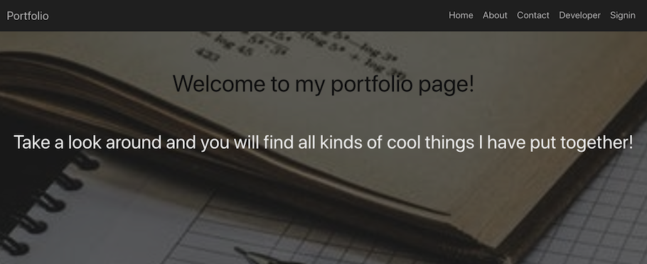

# Portfolio Generator

## Table of Contents

### [Description](#description)
### [Why Portfolio Generator](#why%20portfolio%20generator)
### [How Portfolio Generator Works](#how%20portfolio%20generator%20works)
### [Installation](#installation)
### [Usage](#usage)
### [Features](#features)
### [Technologies Used](#technologies%20used)
### [License](#license)
### [Total GitHub Downloads](#total%20github%20downloads)
### [Contributors](#contributors)
### [Screen Shots](#screen%20shots)

### Description

Portfolio Generator automatically creates a curated portfolio from a developer's GitHub projects. The portfolio is presented in a standardized format for potential employers, or others, to view. 

### Why Portfolio Generator

Developers have limited time to devote to creating an attractive way to display their projects. Developers typically have multiple projects under construction, and may not wish to include all of them in their portfolio. Portfolio Generator was created to automatically produce a professional project portfolio.

### How Portfolio Generator Works

This application allows a developer to retrieve their GitHub projects and select any or all of those to automatically create an attractive portfolio.

Functional Description
Technical Description

### Technologies Used

Profile Generator is a full-stack application. Full-stack means the application uses client side technologies such as HTML (hypertext markup language), CSS (cascading style sheets) and the JavaScript programming, and server side technologies such as Express, Node, and MongoDB. We chose to use the MERN stack of open source software.

The MERN stack is:

<a href="https://www.mongodb.com/">Mongo DB</a> A popular server-side database.

<a href="https://expressjs.com/en/starter/installing.html">Express JS</a> A minimalist web framework that provides features for developing web and mobile applications.

<a href="https://reactjs.org/">React JS</a> A JavaScript library for building user interfaces.

<a href="https://nodejs.org/en/">Node JS</a> Server side JavaScript built on Chrome's V8 JavaScript engine.

#### Libraries

Portfolio Generator uses Semantic UI. 

<a href="https://semantic-ui.com/">Semantic UI</a> A modern front-end development framework, powered by

<a href="https://lesscss.org/">Less CSS</a> which stands for Leaner Style Sheets. Less CSS is a backwards-compatible language extension for CSS and uses

<a href="https://jquery.com/">jQuery</a> A JavaScript library

At a minimum, your project README needs a title and a short description explaining the what, why, and how. What was your motivation? Why did you build this project? (Note: The answer is not "Because it was a homework assignment.") What problem does it solve? What did you learn? What makes your project stand out? If your project has a lot of features, consider adding a heading called "Features" and listing them here.

If you're new to Markdown, read the GitHub guide on [Mastering Markdown](https://guides.github.com/features/mastering-markdown/).

If you need an example of a good README, check out [the VSCode repository](https://github.com/microsoft/vscode).

### Installation

Clone from GitHub repository to local machine.
Mongo installed
Node installed
Configure database file for local settings
Open config file for database is set to XYZ, or if there is a seeds file for seeding data.
Go to project folder
NPM install
NPM start

### Usage 

Provide instructions and examples for use. Include screenshots as needed. 
GIFs or Screencastify video 
Code snippets at bottom of readme.

### Contributors

John Cannon     
<a href="https://github.com/frunox/" alt="John Cannon's GitHub Projects">My GitHub Projects</a>

Shawn Hayes     
<a href="https://github.com/srfrog1970/" alt="John Cannon's GitHub Projects">My GitHub Projects</a>

Tom van Deusen  
<a href="https://github.com/shininglite/" alt="John Cannon's GitHub Projects">My GitHub Projects</a>

Yeng Vang       
<a href="https://github.com/YengHV/" alt="John Cannon's GitHub Projects">My GitHub Projects</a>

If you used any third-party assets that require attribution, list the creators with links to their primary web presence in this section.

If you followed tutorials, include links to those here as well.

### License

 This source code is available to everyone under the standard MIT license.<a href="https://opensource.org/licenses/MIT">MIT license</a>

 

## Badges
<!-- Total github downloads: 	/github/downloads/:user/:repo/total -->
Total GitHub Downloads

Badges aren't _necessary_, per se, but they demonstrate street cred. Badges let other developers know that you know what you're doing. Check out the badges hosted by [shields.io](https://shields.io/). You may not understand what they all represent now, but you will in time.

## Developers

If you created an application or package and would like other developers to contribute it, you will want to add guidelines for how to do so. The [Contributor Covenant](https://www.contributor-covenant.org/) is an industry standard, but you can always write your own.

## Tests

---

This project was bootstrapped with [Create React App](https://github.com/facebook/create-react-app).

## Available Scripts

In the project directory, you can run:

### `npm start`

Runs the app in the development mode. 
Open [http://localhost:3000](http://localhost:3000) to view it in the browser.

The page will reload if you make edits. 
You will also see any lint errors in the console.

### `npm test`

Launches the test runner in the interactive watch mode. 
See the section about [running tests](https://facebook.github.io/create-react-app/docs/running-tests) for more information.

### `npm run build`

Builds the app for production to the `build` folder. 
It correctly bundles React in production mode and optimizes the build for the best performance.

The build is minified and the filenames include the hashes. 
Your app is ready to be deployed!

See the section about [deployment](https://facebook.github.io/create-react-app/docs/deployment) for more information.

### `npm run eject`

**Note: this is a one-way operation. Once you `eject`, you can’t go back!**

If you aren’t satisfied with the build tool and configuration choices, you can `eject` at any time. This command will remove the single build dependency from your project.

Instead, it will copy all the configuration files and the transitive dependencies (webpack, Babel, ESLint, etc) right into your project so you have full control over them. All of the commands except `eject` will still work, but they will point to the copied scripts so you can tweak them. At this point you’re on your own.

You don’t have to ever use `eject`. The curated feature set is suitable for small and middle deployments, and you shouldn’t feel obligated to use this feature. However we understand that this tool wouldn’t be useful if you couldn’t customize it when you are ready for it.

## Learn More

You can learn more in the [Create React App documentation](https://facebook.github.io/create-react-app/docs/getting-started).

To learn React, check out the [React documentation](https://reactjs.org/).

### Code Splitting

This section has moved here: https://facebook.github.io/create-react-app/docs/code-splitting

### Analyzing the Bundle Size

This section has moved here: https://facebook.github.io/create-react-app/docs/analyzing-the-bundle-size

### Making a Progressive Web App

This section has moved here: https://facebook.github.io/create-react-app/docs/making-a-progressive-web-app

### Advanced Configuration

This section has moved here: https://facebook.github.io/create-react-app/docs/advanced-configuration

### Deployment

This section has moved here: https://facebook.github.io/create-react-app/docs/deployment

### `npm run build` fails to minify

This section has moved here: https://facebook.github.io/create-react-app/docs/troubleshooting#npm-run-build-fails-to-minify

### Screen Shots

#### Welcome Screen

#### Create Account

#### Portfolio List

### Return to [Table of Contents](#tablecontents)

