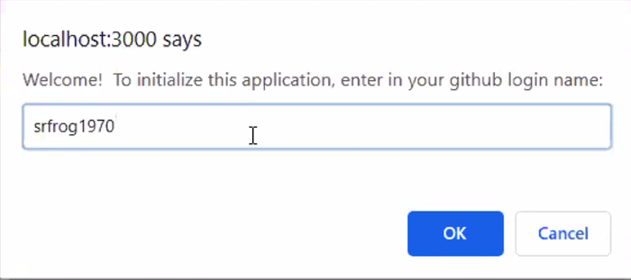
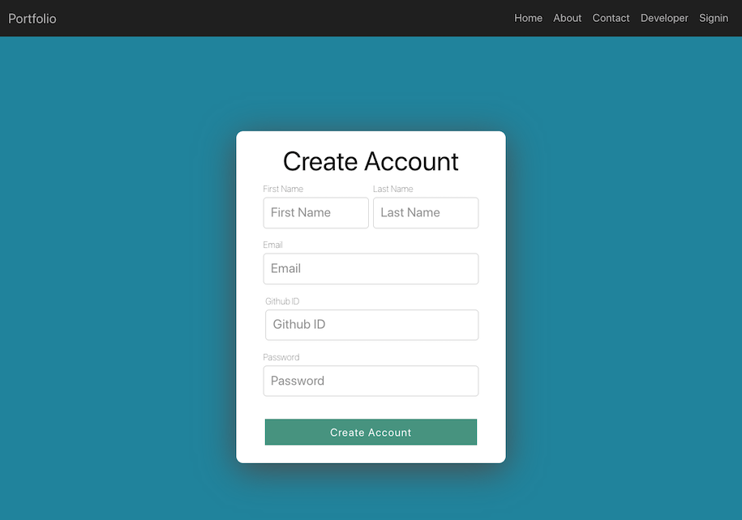
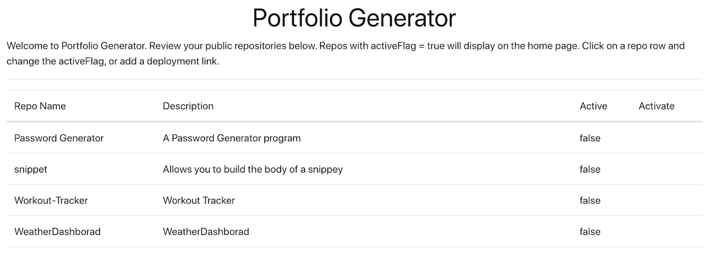

# Portfolio Generator

## Table of Contents

### [Description](#description)
### [Why Portfolio Generator](#why%20portfolio%20generator)
### [How Portfolio Generator Works](#how%20portfolio%20generator%20works)
### [Installation](#installation)
### [Usage](#usage)
### [Features](#features)
### [Technologies Used](#technologies%20used)
### [License](#license)
### [Total GitHub Downloads](#total%20github%20downloads)
### [Contributors](#contributors)
### [Screen Shots](#screen%20shots)

### Description

Portfolio Generator automatically creates a curated portfolio from a developer's GitHub projects. The portfolio is presented in a standardized format for potential employers, or others, to view. 

### Why Portfolio Generator

Developers have limited time to devote to creating an attractive way to display their projects. Developers typically have multiple projects under construction, and may not wish to include all of them in their portfolio. Portfolio Generator was created to automatically produce a professional project portfolio.

### How Portfolio Generator Works

This application allows a developer to retrieve their GitHub projects and select any or all of those to automatically create an attractive portfolio.

Functional Description
Technical Description

### Technologies Used

Profile Generator is a full-stack application. Full-stack means the application uses client side technologies such as HTML (hypertext markup language), CSS (cascading style sheets) and the JavaScript programming, and server side technologies such as Express, Node, and MongoDB. We chose to use the MERN stack of open source software.

The MERN stack is:

<a href="https://www.mongodb.com/">Mongo DB</a> A popular server-side database.

<a href="https://expressjs.com/en/starter/installing.html">Express JS</a> A minimalist web framework that provides features for developing web and mobile applications.

<a href="https://reactjs.org/">React JS</a> A JavaScript library for building user interfaces.

<a href="https://nodejs.org/en/">Node JS</a> Server side JavaScript built on Chrome's V8 JavaScript engine.

#### Libraries

Portfolio Generator uses Semantic UI. 

<a href="https://semantic-ui.com/">Semantic UI</a> A modern front-end development framework, powered by

<a href="https://lesscss.org/">Less CSS</a> which stands for Leaner Style Sheets. Less CSS is a backwards-compatible language extension for CSS and uses

<a href="https://jquery.com/">jQuery</a> A JavaScript library

At a minimum, your project README needs a title and a short description explaining the what, why, and how. What was your motivation? Why did you build this project? (Note: The answer is not "Because it was a homework assignment.") What problem does it solve? What did you learn? What makes your project stand out? If your project has a lot of features, consider adding a heading called "Features" and listing them here.

If you're new to Markdown, read the GitHub guide on [Mastering Markdown](https://guides.github.com/features/mastering-markdown/).

If you need an example of a good README, check out [the VSCode repository](https://github.com/microsoft/vscode).

### Installation

Clone from GitHub repository to local machine.
Mongo installed
Node installed
Configure database file for local settings
Open config file for database is set to XYZ, or if there is a seeds file for seeding data.
Go to project folder
NPM install
NPM start

### Usage 

Provide instructions and examples for use. Include screenshots as needed. 
GIFs or Screencastify video 
Code snippets at bottom of readme.

### Contributors

John Cannon     
<a href="https://github.com/frunox/" alt="John Cannon's GitHub Projects">My GitHub Projects</a>

Shawn Hayes     
<a href="https://github.com/srfrog1970/" alt="John Cannon's GitHub Projects">My GitHub Projects</a>

Tom van Deusen  
<a href="https://github.com/shininglite/" alt="John Cannon's GitHub Projects">My GitHub Projects</a>

Yeng Vang       
<a href="https://github.com/YengHV/" alt="John Cannon's GitHub Projects">My GitHub Projects</a>

If you used any third-party assets that require attribution, list the creators with links to their primary web presence in this section.

If you followed tutorials, include links to those here as well.

### License

 This source code is available to everyone under the standard MIT license.<a href="https://opensource.org/licenses/MIT">MIT license</a>

 

## Badges
<!-- Total github downloads: 	/github/downloads/:user/:repo/total -->
Total GitHub Downloads

Badges aren't _necessary_, per se, but they demonstrate street cred. Badges let other developers know that you know what you're doing. Check out the badges hosted by [shields.io](https://shields.io/). You may not understand what they all represent now, but you will in time.

## Developers

If you created an application or package and would like other developers to contribute it, you will want to add guidelines for how to do so. The [Contributor Covenant](https://www.contributor-covenant.org/) is an industry standard, but you can always write your own.

## Tests

[Description](#description)

[Why Portfolio Generator](#why%20portfolio%20generator)

[How Portfolio Generator Works](#how%20portfolio%20generator%20works)

[Technologies Used](#technologies%20used)

[MERN Stack](#mern%20stack)

[Libraries](#libraries)

[Installation](#installation)

[Usage](#usage)

[Getting Started](#getting%20started)

[Create Account or Sign In](#create%20account%20or%20sign%20in)

[Portfolio List](#portfolio%20list)

[Features](#features)

[Contributors](#contributors)

[License](#license)

[Screen Shots](#screen%20shots)

[Create Account](#create%20account)

[Portfolio List](#portfolio%20list)

[Total Github Downloads](#total%20githubdown%20loads)

[Create React App](#create%20react%20app)

### Description
Portfolio Generator is a React app that automatically creates a curated portfolio from a developer's GitHub projects. The portfolio is presented in a standardized format for potential employers, or others, to view. 

### Why Portfolio Generator
Developers have limited time to devote to creating an attractive way to display their projects. Developers typically have multiple projects under construction, and may not wish to include all of them in their portfolio. Portfolio Generator was created to automatically produce a professional project portfolio.

### How Portfolio Generator Works
This application allows a developer to retrieve their GitHub projects and select any or all of those to automatically create an attractive portfolio.

### Technologies Used
Profile Generator is a full-stack application, using client side and server side technologies. Client side technologies used include HTML (hypertext markup language), CSS (cascading style sheets) and the JavaScript programming. Server side technologies used are Express, Node, and MongoDB. We chose to use the MERN stack of open source software.

#### MERN Stack
The MERN stack is:

<a href="https://www.mongodb.com/">Mongo DB</a>, a popular server-side database.

<a href="https://expressjs.com/en/starter/installing.html">Express JS</a>, a minimalist web framework that provides features for developing web and mobile applications.

<a href="https://reactjs.org/">React JS</a>, a JavaScript library for building user interfaces.

<a href="https://nodejs.org/en/">Node JS</a>, server-side JavaScript built on Chrome's V8 JavaScript engine.

#### Libraries
Portfolio Generator uses:

<a href="https://react.semantic-ui.com/">React Semantic UI</a>, a modern front-end development framework, powered by

<a href="https://lesscss.org/">Less CSS</a> which stands for Leaner Style Sheets. Less CSS is a backwards-compatible language extension for CSS

<a href="https://https://react-bootstrap.github.io/">React Bootstrap</a> is a client-side CSS library rebuilt with true React components without unneeded dependencies like jQuery.

### Installation
- install mongoDB
- install node.js
- install google chrome browser
- go to <a href="https://github.com/shininglite/portfolio-generator">Portfolio Generator Repository</a>  - and click the "Clone or download" button
- copy the command that is now below that button (`git@github.com:shininglite/portfolio-generator.git`)
- cd to the folder where you have your projects on your local machine
- type "`git clone git@github.com:shininglite/portfolio-generator.git`"
- cd to portfolio-generator folder that was just created with the above command
- type "`npm install`" to create a package.json file
- cd to client directory and type "npm install"
- type "`npm start`" to run the application
- go to chrome browser and type "`localhost:3000`" in the search bar

### Usage 

#### Getting Started
The first time you type "`npm start`" you will be prompted to enter your GitHub username.

#### Welcome Screen

Enter your GitHub user name and choose OK

#### Create Account or Sign In
You are then prompted to create an account (or sign in if you have already created an account). An account is needed so that your GitHub username is retained in the Mongo database. The database retains your curated list of projects to publish to your portfolio.

#### Portfolio List
Once you have created an account or signed in, you will see a list of your GitHub projects (repositories). Click the project row, or rows, that you want to activate. Activated projects will appear in your final portfolio.

### Features
We are proud of our work and hope you like it as well. Working together, we created a minimum viable product in 10 days, including: concept, design, database schema, choice of tools and methods, use instructions, documentation, and a live presentation.

### Contributors
John Cannon     
<a href="https://github.com/frunox/" alt="John Cannon's GitHub Projects">My GitHub Projects</a>

Shawn Hayes     
<a href="https://github.com/srfrog1970/" alt="John Cannon's GitHub Projects">My GitHub Projects</a>

Tom van Deusen  
<a href="https://github.com/shininglite/" alt="John Cannon's GitHub Projects">My GitHub Projects</a>

Yeng Vang       
<a href="https://github.com/YengHV/" alt="John Cannon's GitHub Projects">My GitHub Projects</a>

### License
This source code is available to everyone under the standard <a href="https://opensource.org/licenses/MIT">MIT license</a>

### Total GitHub Downloads

### Create React App
This project was bootstrapped with [Create React App](https://github.com/facebook/create-react-app)

